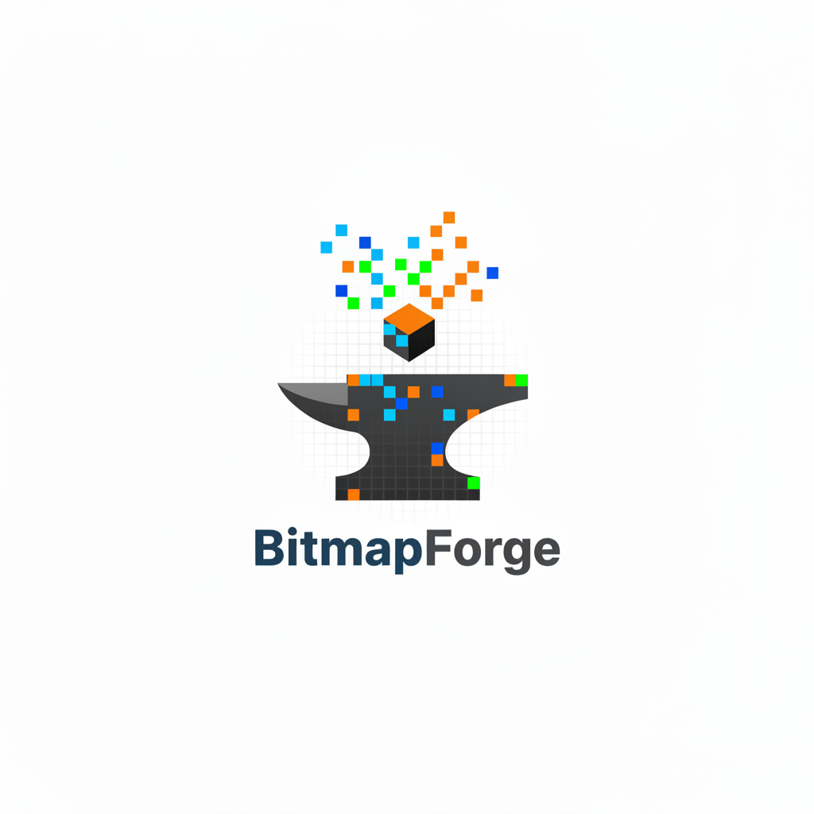

# BitmapForge




BitmapForge is a web application that turns 3D models into stylized bitmap animations.

You can upload a model, tune the visual style (pixel size, dithering, palette, animation, light direction), preview changes in real time, and export the result in multiple formats.

## What It Does

- Loads 3D model files: STL, OBJ, GLTF, GLB
- Renders models with a bitmap/dithered look
- Lets you control:
  - palette (2-6 colors, shadows -> highlights)
  - quality settings (pixel size, dither type, invert, min brightness, background)
  - animation presets (spin axes, float, fade in/out)
  - key light direction
- Exports outputs as:
  - GIF
  - MP4/WebM video
  - PNG sprite sheet
  - embeddable HTML snippet
  - full code ZIP
- Saves work automatically in localStorage and supports `.bitmapforge` project files

## How It Works

1. Three.js renders the 3D scene to a WebGL canvas.
2. The bitmap effect samples brightness values from that render.
3. Brightness is converted into dithered pixel blocks/dots using the selected algorithm.
4. Brightness values are mapped to your color strip (left = shadows, right = highlights).
5. Animation and lighting controls update the scene continuously.
6. Export tools capture one full loop from the preview canvas.

## Quick Start

```bash
npm install
npm run dev
```

Open the local URL printed by Vite.

## Build

```bash
npm run build
npm run preview
```

## Typical Workflow

1. Upload a model.
2. Adjust palette, quality, animation, and light direction.
3. Preview until satisfied.
4. Export to your target format.
5. Save a `.bitmapforge` project file if you want to continue later.

## Documentation

- Product and technical specification: `PROJECT_SPEC.md`

## License

MIT
