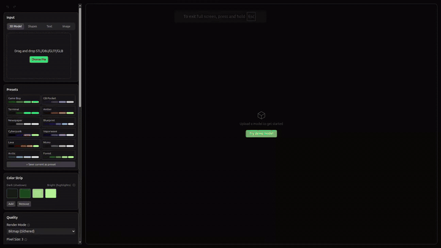

<div align="center">



# BitmapForge

### Turn any 3D model into retro pixel animations — in your browser, no install, no signup.

**[🚀 Try it now →](https://bitmapforge.vercel.app)**


</div>

---

Upload a GLB, OBJ, or STL — pick a dither style, color palette, and animation — export a GIF, sprite sheet, or embeddable component. Everything runs in the browser. Nothing is sent to a server.

---

## Features

### Input

| Type         | Description                                               |
| ------------ | --------------------------------------------------------- |
| **3D Model** | Upload STL, OBJ, GLTF, or GLB                            |
| **Shape**    | Built-in primitives: cube, sphere, torus, cone, and more  |
| **Text**     | Extruded 3D text with 10 font families                    |
| **Image**    | PNG/JPG/SVG rendered as a flat plane                      |

### Render Styles

| Renderer       | Description                                          |
| -------------- | ---------------------------------------------------- |
| **Bitmap**     | Classic Bayer dithering (4×4 / 8×8) or variable dot  |
| **Pixel Art**  | Clean flat squares, no dithering                     |
| **Halftone**   | Circular/diamond dot grid, CMYK mode included        |
| **LED Matrix** | Glowing LED sign board look                          |
| **Stipple**    | Pointillist/stipple art style                        |
| **ASCII**      | Text-based rendering with custom character sets      |

### Animation

8 combinable effects: `Spin X` · `Spin Y` · `Spin Z` · `Float` · `Bounce` · `Pulse` · `Shake` · `Orbit`

### Color & Lighting

- Up to 6 colors, drag-to-reorder — brightness-mapped (shadows → highlights)
- Color-only presets to swap themes without touching other settings
- Draggable key light direction
- Post-processing: CRT scanlines, film grain, hue/saturation shift

### Export

| Format              | Use Case                                                                 |
| ------------------- | ------------------------------------------------------------------------ |
| **APNG**            | Full-color + alpha, web-ready _(default)_                                |
| **GIF**             | Universal compatibility                                                  |
| **WebM**            | Game engines, video editors                                              |
| **Sprite Sheet**    | Tilemap workflows, game frameworks                                       |
| **Standalone HTML** | Drop one file anywhere, it just works                                    |
| **Embed ZIP**       | Embed with one `<bitmap-forge>` tag — no npm needed                      |
| **React Component** | Drop into any React project                                              |
| **Web Component**   | Framework-agnostic custom element                                        |
| **CSS Keyframes**   | Pure CSS animation, no JS required                                       |
| **Lottie JSON**     | Motion design pipelines                                                  |
| **Code ZIP**        | Full Vite project with engine source to self-host                        |

---

## Quick Start

```bash
git clone https://github.com/Santiagocetran/BitmapForge.git
cd BitmapForge
npm install
npm run dev
```

```bash
npm run build    # Production build → dist/
npm test         # Run all tests (540 across 37 files)
```

---

## Tech Stack

| Layer         | Tech                    |
| ------------- | ----------------------- |
| 3D Rendering  | Three.js                |
| Framework     | React 19 + Vite 7       |
| Styling       | Tailwind CSS 4          |
| State         | Zustand                 |
| UI Primitives | Radix UI                |
| GIF Export    | gif.js                  |
| APNG Export   | upng-js                 |
| ZIP Export    | JSZip                   |

---

## Contributing

See [CONTRIBUTING.md](./CONTRIBUTING.md) for setup, code style, and PR guidelines.

Look for [`good first issue`](https://github.com/Santiagocetran/BitmapForge/issues?q=is%3Aissue+is%3Aopen+label%3A%22good+first+issue%22) tags for a starting point.

---

## Roadmap

- [ ] Per-layer color palettes and animation controls
- [ ] More export targets (SVG animation, Three.js scene)

---

<div align="center">

Made with ❤️ by [@santicetran](https://x.com/santicetran) · MIT License

</div>
